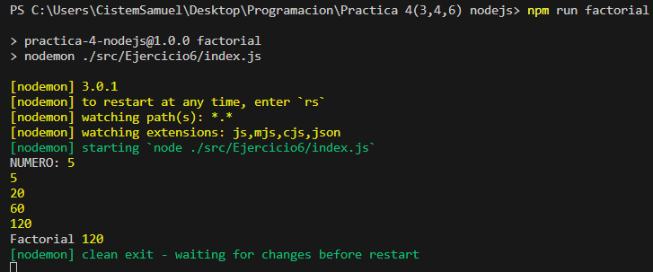

# **Proyecto General**

**Practicas de maquetación, DOM JS y NODE JS:**
- **[Practica 1: Task App](./src/task-app/README.md)**
Crud para tareas pendientes y completadas`(HTML,CSS,JS)`.
- **[Practica 2: More App](./src/Moreapp/README.md)**
Maquetación de login simple`(HTML,CSS)`.
- **[Practica 3: Login](./src/Login/README.md)**
Maquetación de login intermedio`(HTML,CSS)`.
- **[Practica 4: Ejercicio 3(Logs de error,facturas y factorial)](/src/Tres-Practicas-node-js/README.md)**
   > * Creación de logs por errores generados`(Node JS(Javascript))`.
   >
   > * Determinación de facturas timbradas y canceladas`(Node JS(Javascript))`.
   >
   > * Determinación del factorial de un numero`(Node JS(Javascript))`.

**Practicas FreeCodeCamp:**
- **[Citas aleatorias:](./src/Practicas-freecodecamp/Citas-aleatorias/description.md)** Generador aleatorio de citas`(HTML,CSS,JS)`.
- **[Color aleatorio:](./src/Practicas-freecodecamp/Color-aleatorio/description.md)** Cambio de color para el fondo con generación cadena hexadecimal aleatoria`(HTML,CSS,JS)`.
- **[Color-RGB:](./src/Practicas-freecodecamp/Color-RGB/description.md)** Generador de colores RGB para el fondo por medio de rangos de valores`(HTML,CSS,JS)`.

**Practicas VUE JS:**
- **[Login:](./src/VueJS/PracticaLoginVueJS/vue-login/README.md)** Inicio de sesion y registro de usuario.
- **[Contador:](./src/VueJS/PracticasContadorVueJS/vue-introduction/README.md)** Contador con parametros.
## **Verificación de Requisitos**

- **Verificar Node**: 

    ```bash
    node -v
    ```

    > **NOTA**: En caso de no contar con la instalación de Node.js acceda al siguiente enlace **[NODE.JS](https://nodejs.org/es)**, y con el siguiente comando podra determinar si se hizo la instalación correcta:
    >
    >Muestra las versiones de las tecnologias instaladas:
    >
    >```proweshell
    >    npm -v 
    >    node -v
    >```

## **Pasos de Instalación**

Siga estos pasos para instalar y ejecutar el proyecto localmente:

1. Clone el siguiente repositorio:

    ```proweshell
    git clone https://github.com/SamuelCM123/ProyectoGeneral.git
    ```

2. Desplazarse al proyecto:

    ```bash
    cd "ProyectoGeneral"
    ```

3. Instalar los módulos de Node:

    ```bash
    npm install
    ```

4. Abrir el proyecto en un editor de código:

    > **NOTA**: Se recomienda, que se utilice **[Visual Studio Code](https://code.visualstudio.com/download)**. De tenerlo, use el comando `code .`

4. Instalar la extension **[Live Server](https://marketplace.visualstudio.com/items?itemName=ritwickdey.LiveServer)** (para Visual Studio Code).

    > **NOTA**: Es opcional, en caso de no querer instalar la extensión pase al siguiente paso.

## **Pasos de ejecución**


1. Para visualizar el indice del proyecto general puede ejecutar el proyecto general con la extension **[Live Server](https://marketplace.visualstudio.com/items?itemName=ritwickdey.LiveServer)** (para Visual Studio Code), y simplemente entra al `index.html` principal del proyecto.

    > **NOTA**: Si usted no utiliza Visual Studio Code o no cuenta con la extensión live server, puede abrir directamente el `index.html` en el navegador de esta ruta `"/ProyectoGenerales/src/index.html"`.
    >
    > **NOTA**: Existen varios `index.html` en el proyecto, el principal que se necesitara ejecutar sera el que esta ubicado en la ruta antes dicha `"/ProyectoGenerales/src/index.html"`.

2. Para poder acceder a la practica 4 que abarca el modulo de facturas, logs y factorial sera necesario ingresar los siguientes comandos a la terminal:

    - Practica 3: Log de errores:

        ```bash
        npm run generate-log
        ```

    <div align="center">
        
    </div>

    - Practica 4: Formateo de facturas:

        ```bash
        npm run amount-bills
        ```

    <div align="center">
        
    </div>
    <div align="center">
        
    </div>

    - Practica 6: Determinación de factorial de un numero:

        ```bash
            npm run factorial
        ```
    
    <div align="center">
        
    </div>

3. Para visualizar los proyectos de Vue JS(Contador y login), es necesario seguir los siguientes pasos para levantar cada proyecto por consola:

    ### **Contador en Vue JS**:
    - Cambiarse a la siguiente carpeta:
    ```bash
        cd .\src\VueJS\PracticasContadorVueJS\vue-introduction\
    ```

    - Introducir el siguiente comando:
    ```bash
        npm run dev
    ```
    ### **Login en Vue JS**:
    - Cambiarse a la siguiente carpeta:
    ```bash
        cd .\src\VueJS\PracticaLoginVueJS\vue-login\
    ```

    - Introducir el siguiente comando:
    ```bash
        npm run dev
    ```
## **Contacto**

Si tienes alguna pregunta o comentario, no dudes en contactarme 🙋🏻‍♂️:

-- **Correo Electrónico**: samuel.calderon@cistem.com.mx