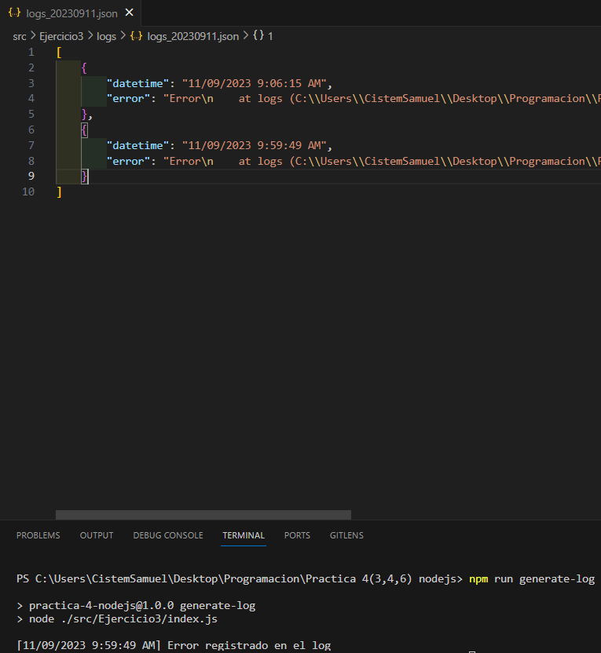
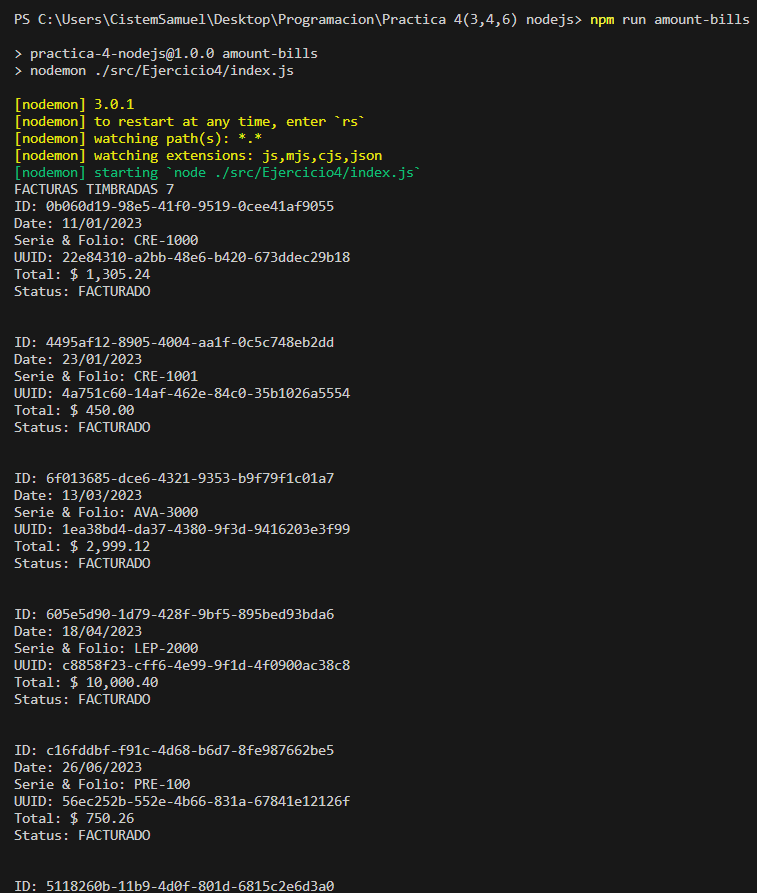

# **Proyecto General**

- **[Practica 1: Task App](./src/task-app/README.md)**
Crud para tareas pendientes y completadas.
- **[Practica 2: More App](./src/Moreapp/README.md)**
Maquetación de login simple.
- **[Practica 3: Login](./src/Login/README.md)**
Maquetación de login intermedio.
- **[Practica 4: Ejercicio 3(Logs de error,facturas y factorial)](/src/Tres-Practicas-node-js/README.md)** 
   > * Creación de logs por errores generados.
   >
   > * Determinación de facturas timbradas y canceladas.
   >
   > * Determinación del factorial de un numero.

## **Verificación de Requisitos**

- **Verificar Node**: 

    ```bash
    node -v
    ```

    > **NOTA**: En caso de no contar con la instalación de Node.js acceda al siguiente enlace **[NODE.JS](https://nodejs.org/es)**, y con el siguiente comando podra determinar si se hizo la instalación correcta:
    >
    >Muestra las versiones de las tecnologias instaladas:
    >
    >```proweshell
    >    npm -v 
    >    node -v
    >```

## **Pasos de Instalación**

Siga estos pasos para instalar y ejecutar el proyecto localmente:

1. Clone el siguiente repositorio:

    ```proweshell
    git clone https://github.com/SamuelCM123/ProyectoGeneral.git
    ```

2. Desplazarse al proyecto:

    ```bash
    cd "ProyectoGeneral"
    ```

3. Instalar los módulos de Node:

    ```bash
    npm install
    ```

4. Abrir el proyecto en un editor de código:

    > **NOTA**: Se recomienda, que se utilice **[Visual Studio Code](https://code.visualstudio.com/download)**. De tenerlo, use el comando `code .`

4. Instalar la extension **[Live Server](https://marketplace.visualstudio.com/items?itemName=ritwickdey.LiveServer)** (para Visual Studio Code).

    > **NOTA**: Es opcional, en caso de no querer instalar la extensión pase al siguiente paso.

## **Pasos de ejecución**


1. Para visualizar el indice del proyecto general puede ejecutar el proyecto general con la extension **[Live Server](https://marketplace.visualstudio.com/items?itemName=ritwickdey.LiveServer)** (para Visual Studio Code), y simplemente entra al `index.html` principal del proyecto.

    > **NOTA**: Si usted no utiliza Visual Studio Code o no cuenta con la extensión live server, puede abrir directamente el `index.html` en el navegador de esta ruta `"/ProyectoGenerales/src/index.html"`.
    >
    > **NOTA**: Existen varios `index.html` en el proyecto, el principal que se necesitara ejecutar sera el que esta ubicado en la ruta antes dicha `"/ProyectoGenerales/src/index.html"`.

2. Para poder acceder a la practica 4 que abarca el modulo de facturas, logs y factorial sera necesario ingresar los siguientes comandos a la terminal:

- Practica 3: Log de errores:

    ```bash
    npm run generate-log
    ```

    <div align="center">
        
    </div>

- Practica 4: Formateo de facturas:

    ```bash
    npm run amount-bills
    ```

    <div align="center">
        
    </div>
    <div align="center">
        
    </div>

- Practica 6: Determinación de factorial de un numero:

    ```bash
        npm run factorial
    ```
    
    <div align="center">
        
    </div>

## **Contacto**

Si tienes alguna pregunta o comentario, no dudes en contactarme 🙋🏻‍♂️:

-- **Correo Electrónico**: samuel.calderon@cistem.com.mx