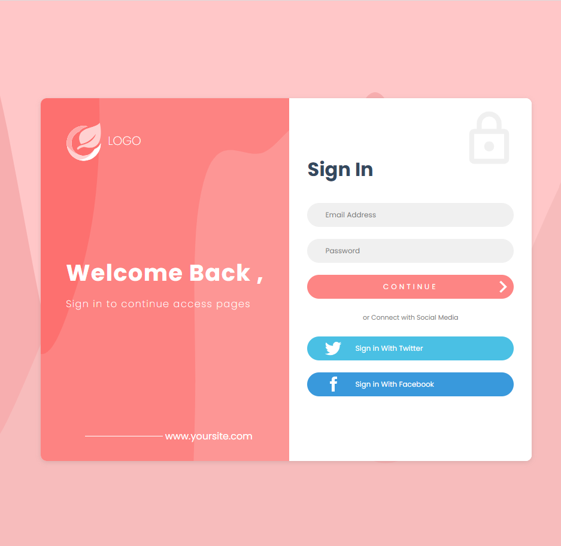

# **Practica #3: Login**

## **Descripción**

Maquetación de login, con HTML y CSS puro, donde contiene logo y botones de redireccionamiento para diferentes inicios de sesión.

## **Previsualización de proyecto**
<!--  -->
<div align="center">
    
</div>

## **Pasos de Instalación**

Siga estos pasos para instalar y ejecutar el proyecto localmente:

1. Clone el siguiente repositorio:

    ```proweshell
    git clone https://github.com/SamuelCM123/Practica3-Login.git
    ```

2. Abrir el proyecto en un editor de código.

    > **NOTA**: Se recomienda, que se utilice **[Visual Studio Code](https://code.visualstudio.com/download)**.

3. Ejecutar el proyecto con la extension **[Live Server](https://marketplace.visualstudio.com/items?itemName=ritwickdey.LiveServer)** (para Visual Studio Code).

    > **NOTA**: Si usted no utiliza Visual Studio Code, puede abrir directamente el `index.html` en el navegador.

## **Personalización**

Si deseas personalizar el sitio, puedes editar el archivo `css/styles.css` para cambiar los estilos y actualizar el contenido en `index.html`.

## **Contacto**

Si tienes alguna pregunta o comentario, no dudes en contactarme 🙋🏻‍♂️:

- ✨ **Correo Electrónico**: samuel.calderon@cistem.com.mx
