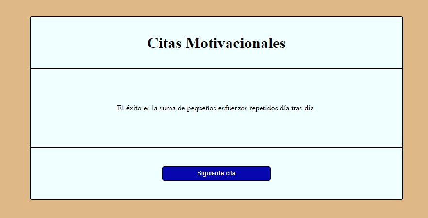

# **Practica FreeCodeCamp: Citas-aleatorias**

    

##  **Descripción de practica:**
Conocimientos aplicados en maquetación y aprendizajes:
* Flexbox.
* CSS Grid.
* DOM JS(Eventos click, Objeto Math).
* Manipulación de array de objetos.
* Modularización de codigo.
* Maquetación con metodologia BEM.

    En esta sencilla práctica repasé conceptos de maquetación y DOM ya antes vistos, la novedad en este caso sería la práctica de los conceptos para las buenas prácticas, básicamente en las prácticas desarrolladas estuve implementando una nueva maquetación de clases que ayuda a la legibilidad y entendimiento del código, también por el lado del JS apliqué modularidad de código para la separación de las diferentes funciones y objetos.

 

    El resultado de esta práctica es una interfaz que al realizar clic en el botón lanza un evento que sobrescribe la cita e inserta otra de forma aleatoria.

