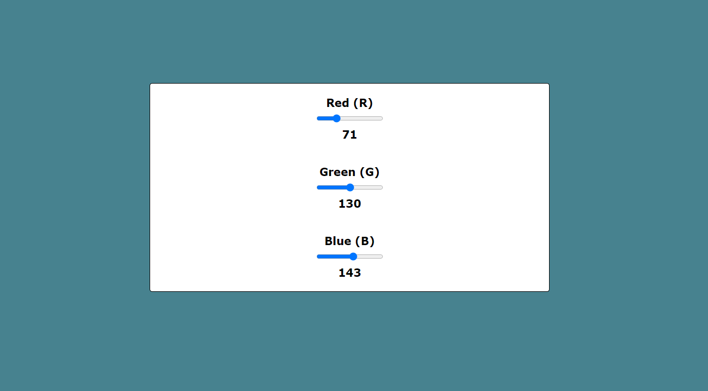

# **Practica FreeCodeCamp: Color-RGB**

    

##  **Descripción de practica:**
Conocimientos aplicados en maquetación y aprendizajes:
* Utilizacion de atributos HTML.
* DOM JS(Estilos,Evento "change",ciclo foreach).

    El objetivo de esta practica era practicar las distintas funcionalidades que podemos aplicar para la maquetacion, dio como resultado 3 inputs que sirven como selectores de rango para despues dinamicamente al realizar un cambio en sus valores lanzara un evento "change" que tomara los valores actuales de los 3 inputs para despues asignarlo al background-color del elemento contenedor, todo esto por medio del DOM y con uso de "template strings" para que el background-color tome el color en valor RGB.

