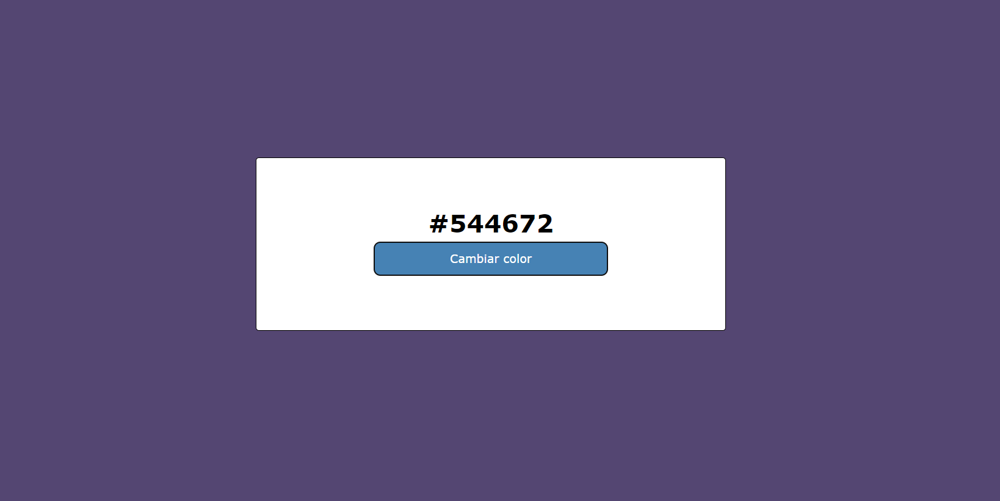

# **Practica FreeCodeCamp: Color-aleatorio**

    

##  **Descripción de practica:**
Conocimientos aplicados en maquetación y aprendizajes:
* Flexbox.
* DOM JS(Eventos, Hexadecimales, Ciclos, Objeto Math).

   El sencillo resultado de esta práctica es lanzar un evento al dar clic en el botón, que genere una cadena de un hexadecimal que, por medio de un foreach y con el objeto Math, crea de manera aleatoria. Esto guarda 6 caracteres generados aleatoriamente y los concatena en una variable para después asignarla por medio del DOM.

