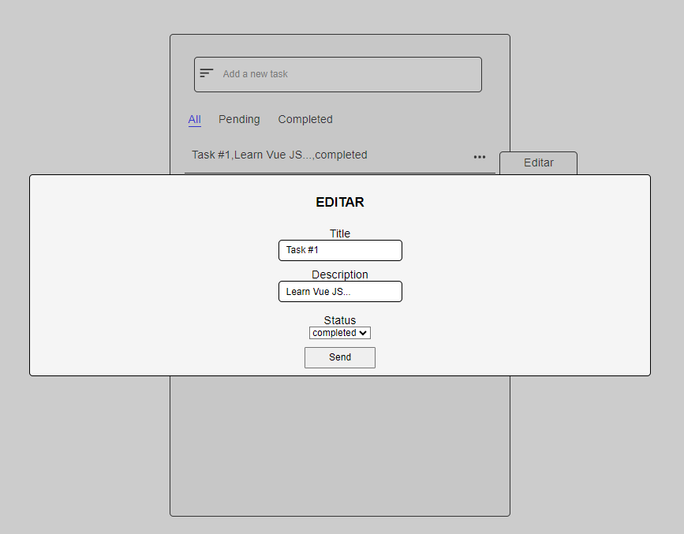

# **Practica #1: Task App**

    

## **Descripción de práctica:**
Conocimientos aplicados en maquetación y aprendizajes:
* Flexbox.
* CSS Grid.
* DOM JS.
* "Manipulación de json".
* Manipulación de objetos(CRUD).
* Mejora en estructura del proyecto(Orden de archivos).
* Distinción de la especificidad.
* Creación de eventos en JS.
* Adición de elementos modales(Ventanas flotantes).
* Uso de pseudo-elementos.
* Modularización de bloques de código.
* Carga dinámica de registros.

En esta práctica utilicé mis propios conocimientos para desarrollarla, básicamente fue JavaScript vanilla(JS puro), HTML y CSS. Con este primer ejercicio integré mis conocimientos de Front-End, ya que con conocimiento propio desarrollé toda la parte visual de la maquetación, como la ventana de opciones de cada registro para la realización de un CRUD, tanto como la ventana modal que se abre al querer realizar una actualización de registro.

 

Javascript lo utilicé para integrar la interacción del usuario con los elementos del formulario, en donde cada click a los elementos desataba un evento dependiendo de si dabas click o enter, en donde al dar enter era más que nada para el registro de las tareas, ya que en este caso la práctica consistía en realizar el registro sin la necesidad de contar con un botón.

 

En cuanto a los conocimientos adquiridos por la retroalimentación como primera práctica, menciono el primer punto que fue el de conocer y tener claro que la estructura de archivos es importante y también es la primera vez que tuve relación con conceptos teóricos en cuanto a las metodologías de maquetación, estos temas ya los tengo claros y los trato de implementar en cada práctica nueva.

